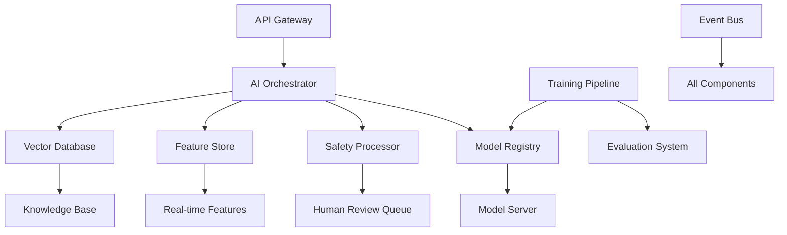

# AI Orchestrator for Mental Health Support

> **Production-ready backend architecture for intelligent AI routing with comprehensive safety guardrails, continuous learning, and crisis intervention capabilities.**

## 🎯 Overview

The AI Orchestrator is a sophisticated backend system designed specifically for mental health applications. It provides:

- **Intelligent Query Routing**: Automatically selects the best AI model based on user context and query type
- **Comprehensive Safety**: Multi-layer safety checks with real-time crisis detection and human escalation
- **Continuous Learning**: Automated model fine-tuning based on user feedback and interaction patterns  
- **Scalable Architecture**: Production-ready microservices with event-driven communication
- **Mental Health Focus**: Specialized safety protocols and crisis intervention workflows

## 🏗️ Architecture



### Core Components

1. **AI Orchestrator**: Central brain that routes queries and coordinates responses
2. **Safety Processor**: Multi-layer safety analysis with crisis detection
3. **Model Registry & Server**: Manages and serves ML models with auto-scaling
4. **Feature Store**: Real-time and batch feature computation and storage
5. **Vector Database**: Semantic search and RAG capabilities
6. **Training Pipeline**: Automated MLOps with continuous learning
7. **Event Bus**: Event-driven architecture for system coordination

## 🚀 Quick Start

### Prerequisites

- Node.js 18+ 
- TypeScript 5+
- Redis 6+
- PostgreSQL 14+
- Docker (optional)

### Installation

```bash
# Clone the repository
git clone https://github.com/11mercado/ai-orchestrator
cd ai-orchestrator/backend

# Install dependencies
npm install

# Configure environment
cp .env.example .env
# Edit .env with your configuration

# Build the application
npm run build

# Start in development mode
npm run dev

# Or start in production mode
npm start
```

### Docker Deployment

```bash
# Build the Docker image
docker build -t ai-orchestrator .

# Run with Docker Compose (includes Redis & PostgreSQL)
docker-compose up -d

# Check health
curl http://localhost:3000/health
```

## 📡 API Endpoints

### Authentication

```bash
# Login and get JWT token
POST /api/v1/auth/login
{
  "userId": "user123",
  "sessionId": "session456",
  "consentToTrain": true
}
```

### Query Processing

```bash
# Process AI query
POST /api/v1/query
Authorization: Bearer <jwt-token>
{
  "query": "I'm feeling really anxious about my upcoming exams",
  "sessionId": "session456",
  "context": {
    "isExamPeriod": true,
    "conversationHistory": []
  }
}
```

### Feedback & Learning

```bash
# Submit feedback for continuous learning
POST /api/v1/feedback
{
  "eventId": "evt_123",
  "rating": 4,
  "helpful": true,
  "categories": ["empathetic", "helpful"]
}
```

### Safety & Crisis

```bash
# Report crisis situation
POST /api/v1/crisis
{
  "eventId": "evt_123",
  "level": "intervention",
  "indicators": ["hopelessness", "suicidal_ideation"]
}
```

## 🛡️ Safety & Crisis Features

### Multi-Layer Safety Analysis

1. **Input Filtering**: Real-time analysis of user messages for harmful content
2. **Crisis Detection**: Advanced algorithms to identify suicide risk and self-harm
3. **Output Validation**: Ensures AI responses are appropriate and helpful
4. **Human Review**: Automated escalation to trained human moderators

### Crisis Intervention Protocol

```typescript
// Automatic crisis response levels
enum CrisisLevel {
  NONE = 'none',           // No intervention needed
  WATCH = 'watch',         // Monitor closely
  INTERVENTION = 'intervention', // Human review required
  EMERGENCY = 'emergency'  // Immediate escalation
}
```

### Emergency Resources

- **US**: National Suicide Prevention Lifeline (988)
- **Philippines**: DOH Crisis Hotline (1553), Hopeline (0917-558-4673)
- **Global**: Crisis Text Line (741741)

## 🤖 Machine Learning & AI

### Supported Model Types

- **Mental Health Specialists**: Fine-tuned for therapeutic conversations
- **Crisis Detection Models**: Specialized in identifying risk indicators
- **Educational Support**: STEM tutoring and academic guidance
- **Safety Classifiers**: Content moderation and harm detection

### Continuous Learning Pipeline

```typescript
// Automated retraining triggers
const retrainingTriggers = {
  negativeRate: 0.3,        // 30% negative feedback
  averageRating: 3.0,       // Below 3.0 rating
  driftScore: 0.5,          // Model performance drift
  safetyViolations: 0.05    // 5% safety violations
};
```

### Model Evaluation Metrics

- **Performance**: Accuracy, Precision, Recall, F1-Score
- **Safety**: Toxicity rate, Crisis detection accuracy, False positive/negative rates
- **Bias**: Fairness across demographics, Equal opportunity metrics
- **Robustness**: Adversarial resistance, Edge case handling

## 📊 Features & Personalization

### Real-time Feature Computation

- **User Behavior**: Engagement patterns, session duration, response quality
- **Contextual**: Time of day, device type, conversation flow
- **Mental Health**: Sentiment analysis, stress indicators, risk assessment
- **Interaction**: Query complexity, topic preferences, feedback patterns

### Feature Store Architecture

```typescript
// Feature computation pipeline
const featurePipeline = {
  realtime: ['current_sentiment', 'urgency_level', 'context_relevance'],
  batch: ['engagement_score', 'topic_preferences', 'behavior_patterns'],
  streaming: ['conversation_flow', 'risk_indicators']
};
```

## 🗄️ Data Management

### Vector Database Usage

- **Conversation Memory**: Store user interactions for context-aware responses
- **Knowledge Base**: Educational content, mental health resources, FAQs
- **User Patterns**: Behavioral insights for personalization
- **Semantic Search**: RAG-powered information retrieval

### Privacy & Compliance

- **Data Minimization**: Collect only necessary information
- **Anonymization**: Hash user identifiers, remove PII
- **Retention Policies**: Automatic data cleanup (90-day default)
- **Consent Management**: Granular consent for training data usage

## 📈 Monitoring & Observability

### Health Checks

```bash
# System health
GET /health

# Detailed component status
GET /api/v1/admin/stats
```

### Key Metrics

- **Response Time**: P50, P95, P99 latencies
- **Safety Metrics**: Crisis detection rate, false positives
- **Model Performance**: Accuracy, user satisfaction scores
- **System Health**: CPU, memory, error rates

### Alerting

- **Crisis Situations**: Immediate alerts to human reviewers
- **System Issues**: Performance degradation, component failures
- **Security Events**: Unusual access patterns, potential attacks

## 🚀 Production Deployment

### Kubernetes Deployment

```bash
# Apply Kubernetes manifests
kubectl apply -f k8s/

# Check deployment status
kubectl get pods -n ai-orchestrator
```

### Environment Configuration

```bash
# Production environment variables
NODE_ENV=production
LOG_LEVEL=warn
ENABLE_METRICS=true
SAFETY_THRESHOLD_STRICT=true
```

### Scaling Considerations

- **API Gateway**: Horizontal scaling with load balancer
- **Model Server**: GPU-enabled nodes with auto-scaling
- **Database**: Read replicas, connection pooling
- **Cache**: Redis cluster for high availability

## 🧪 Testing

```bash
# Run all tests
npm test

# Run with coverage
npm run test:coverage

# Run specific test suite
npm test -- --grep "Safety Processor"

# Integration tests
npm run test:integration
```

### Test Categories

- **Unit Tests**: Individual component functionality
- **Integration Tests**: Component interaction testing
- **Safety Tests**: Crisis detection and safety validation
- **Performance Tests**: Load testing and benchmarking
- **End-to-End Tests**: Full workflow validation

## 🤝 Contributing

### Development Setup

1. Fork the repository
2. Create a feature branch: `git checkout -b feature/amazing-feature`
3. Install dependencies: `npm install`
4. Run tests: `npm test`
5. Submit a pull request

### Code Standards

- **TypeScript**: Strict type checking enabled
- **ESLint**: Automated code linting
- **Prettier**: Code formatting
- **Jest**: Testing framework

### Safety Guidelines

- **Never bypass safety checks** in production code
- **Test crisis scenarios** thoroughly
- **Document safety-critical functions** extensively
- **Review mental health content** with qualified professionals

## 📄 API Documentation

Full API documentation is available at:
- Development: `http://localhost:3000/api/v1/docs`
- Production: `https://your-domain.com/api/v1/docs`

### Key API Features

- **OpenAPI 3.0** specification
- **Interactive testing** with Swagger UI
- **Rate limiting** and authentication
- **Request validation** and error handling
- **Comprehensive examples** and schemas

## 🔒 Security

### Security Measures

- **JWT Authentication**: Secure token-based auth
- **Rate Limiting**: Protection against abuse
- **Input Validation**: Comprehensive request sanitization
- **HTTPS Only**: Encrypted communication
- **CORS Configuration**: Controlled cross-origin access

### Vulnerability Reporting

Please report security vulnerabilities to:
- Email: security@11mercado.org
- Include detailed reproduction steps
- Allow 48 hours for initial response

## 📞 Support & Resources

### Crisis Resources

**If you or someone you know is in crisis, please contact:**

- **US**: National Suicide Prevention Lifeline - **988**
- **Philippines**: DOH Crisis Hotline - **1553**
- **Global**: Crisis Text Line - Text "HOME" to **741741**
- **Emergency**: Call your local emergency number (**911**, etc.)

### Technical Support

- **Documentation**: [GitHub Wiki](https://github.com/11mercado/ai-orchestrator/wiki)
- **Issues**: [GitHub Issues](https://github.com/11mercado/ai-orchestrator/issues)
- **Discussions**: [GitHub Discussions](https://github.com/11mercado/ai-orchestrator/discussions)
- **Email**: support@11mercado.org

## 📜 License

MIT License - see [LICENSE](LICENSE) for details.

## 🙏 Acknowledgments

- **Mental Health Professionals** for guidance on crisis intervention protocols
- **Open Source Community** for the amazing tools and libraries
- **11Mercado PTA Team** for supporting this mental health initiative
- **Contributors** who help make this system safer and more effective

---

**⚠️ Important Disclaimer**: This system is designed to support, not replace, professional mental health services. Always encourage users experiencing mental health crises to seek help from qualified professionals.